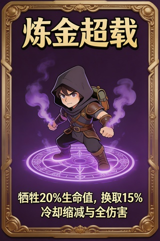
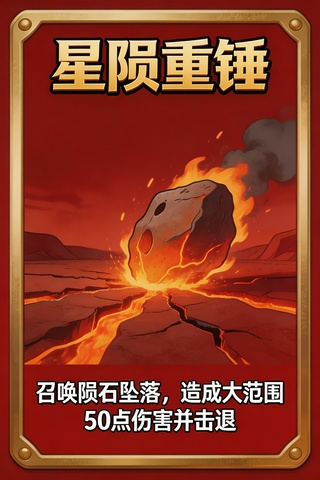
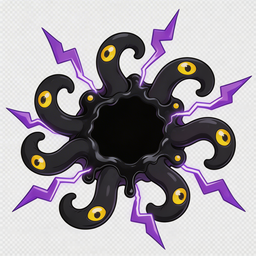
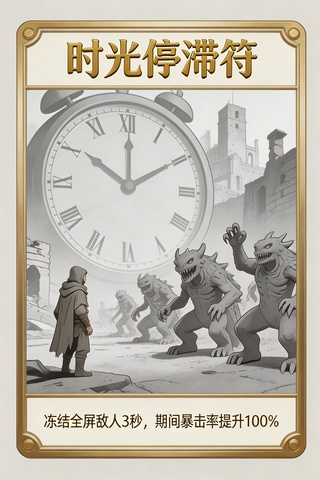
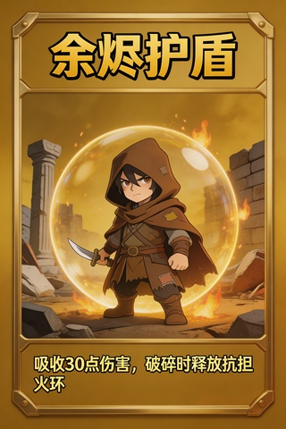
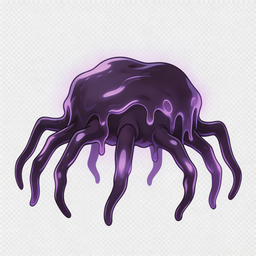

<div align="center">

# 🎮 Roguelike Generator

**AI 驱动的 Roguelike 游戏全自动生成系统**

一句话描述 → 多 Agent 协作设计 → AI 绘图生成素材 → 可运行的 HTML5 游戏原型

<br/>


</div>

---

## 演示视频

🎬 [点击观看演示视频](https://www.bilibili.com/video/BV12TcZzoETh/)

> 📹 演示视频

---

## Demo 预览

以下素材由系统从一句话描述完整生成，零手工干预：

<table>
<tr>
<th align="center">卡牌素材</th>
<th align="center">卡牌素材</th>
<th align="center">敌人素材</th>
</tr>
<tr>
<td align="center"><br/><sub>炼金过载</sub></td>
<td align="center"><br/><sub>流星锤</sub></td>
<td align="center"><br/><sub>Boss · 吞噬者</sub></td>
</tr>
<tr>
<td align="center"><br/><sub>时间凝滞</sub></td>
<td align="center"><br/><sub>余烬护盾</sub></td>
<td align="center"><br/><sub>爬行者</sub></td>
</tr>
</table>

> 生成的 HTML5 游戏原型：`backend/static/games/3c1d182b-f36e-44eb-abb8-8a154751a437/index.html`，用浏览器直接打开即可体验。

---

## 核心特性

| 特性 | 说明 |
|------|------|
| 🤖 **8 Agent 协作** | 需求分析 → 并行设计（玩法/世界观/美术/技术）→ 文档整合 → 意图解析 → 精准修订 |
| ⚡ **并行加速** | 四路设计 Agent 同时运行，总耗时大幅压缩 |
| 🎨 **AI 双引擎绘图** | 豆包 Seedream（角色/卡牌）+ Gemini 3 Pro Image（背景/关键艺术图）|
| 🕹️ **HTML5 游戏生成** | 使用 GPT Codex 专用模型生成可直接运行的完整游戏代码 |
| 📡 **SSE 流式输出** | 实时推送每个 Token 和 Agent 状态，打字机效果 |
| 🔁 **Human-in-the-Loop** | 每轮生成后暂停等待用户审阅，基于 LangGraph `interrupt` |
| ✂️ **外科手术修订** | 精准修改单个章节，不影响其他已生成模块 |
| 📚 **版本历史** | 基于 LangGraph Checkpointer，支持一键回滚任意历史版本 |
| 🌌 **赛博朋克 UI** | 粒子背景、Glitch 特效、霓虹配色、终端风界面 |

---

## Agent 架构

```
用户输入
   │
   ▼
[意图解析 Agent] ──→ 新建 or 修订?
   │                       │
   │ (新建)          (修订) ├──→ [外科手术修改 Agent] ──→ 精准更新单章节
   ▼
[需求分析 Agent] ──→ 结构化需求 JSON
   │
   ├──────────────────────────────────┐
   ▼                                  ▼
[玩法设计 Agent]              [世界观 Agent]
[美术资源 Agent]              [技术方案 Agent]
   └──────────────────────────────────┘
                    │ (四路并行)
                    ▼
           [文档整合 Agent] ──→ 完整 .md 设计方案
                    │
                    ▼
           [代码生成器 · GPT Codex] ──→ HTML5 游戏原型
                    │
                    ▼
           Human-in-the-Loop ← 用户审阅 / 修改 / 确认
```

| Agent | 模型 | 职责 |
|-------|------|------|
| 意图解析 | `OPENAI_MODEL` | 判断用户意图：全新生成 / 局部修改 |
| 需求分析 | `OPENAI_MODEL` | 将用户描述解析为结构化 JSON |
| 玩法设计 | `OPENAI_MODEL` | 生成卡牌体系、关卡结构、组合机制 |
| 世界观 | `OPENAI_MODEL` | 构建背景故事、场景风格、配色方案 |
| 美术资源 | `OPENAI_MODEL` | 规划素材清单、AI 绘图提示词 |
| 技术方案 | `OPENAI_MODEL` | 输出技术选型、架构设计、代码示例 |
| 文档整合 | `OPENAI_MODEL` | 合并所有模块为完整设计方案 |
| 外科手术修改 | `OPENAI_MODEL` | 精准修改指定章节 |
| **代码生成器** | **`CODE_MODEL`** | **生成 HTML5 游戏完整代码** |

---

## 项目结构

```
Roguelike/
├── backend/
│   ├── agents/
│   │   ├── nodes.py              # 8 个 Agent 节点实现
│   │   ├── code_generator.py     # HTML5 游戏代码生成（GPT Codex）
│   │   └── code_reviewer.py      # 代码审查与修复
│   ├── api/
│   │   ├── sessions.py           # REST + SSE 流式接口
│   │   └── history.py            # 会话历史接口
│   ├── db/
│   │   └── session_store.py      # SQLite 会话持久化
│   ├── graph/
│   │   ├── builder.py            # LangGraph 图构建
│   │   └── state.py              # 全局状态定义
│   ├── prompts/
│   │   └── system_prompts.py     # 各 Agent System Prompt
│   ├── tools/
│   │   ├── art_pipeline.py       # AI 绘图完整流程
│   │   ├── image_generators.py   # 豆包 / Gemini 图像生成
│   │   ├── image_processor.py    # 图片后处理
│   │   ├── doc_formatter.py      # Markdown 文档格式化
│   │   └── intent_utils.py       # 意图解析工具
│   ├── static/
│   │   ├── art/                  # AI 生成的游戏素材图片
│   │   └── games/                # 生成的 HTML5 游戏文件
│   ├── config.py                 # 配置读取（.env）
│   ├── main.py                   # FastAPI 入口
│   └── requirements.txt
│
├── frontend/
│   └── src/
│       ├── pages/
│       │   ├── Landing.tsx       # 首页
│       │   ├── Workspace.tsx     # 主工作区（对话 + 设计文档）
│       │   ├── GameStudio.tsx    # 游戏预览 & 代码编辑
│       │   ├── Workshop.tsx      # 素材工坊
│       │   └── History.tsx       # 历史会话列表
│       ├── components/
│       │   ├── agents/           # Agent 状态面板、版本时间线
│       │   ├── terminal/         # 终端风对话区、快捷指令
│       │   ├── document/         # Markdown 预览
│       │   └── effects/          # 粒子背景、Glitch 特效
│       ├── hooks/                # useAgentStream（SSE）、useSession
│       ├── store/                # Zustand 全局状态
│       └── types/
│
├── start.sh                      # 一键启动脚本
└── .env.example                  # 环境变量模板
```

---

## 快速启动

### 一键启动（推荐）

```bash
# 克隆项目
git clone https://github.com/your-username/Roguelike.git
cd Roguelike

# 配置环境变量
cp backend/.env.example backend/.env
# 编辑 backend/.env，填入你的 API Key

# 一键启动前后端
./start.sh
```

脚本自动完成：检测 `.env` → 安装虚拟环境和 npm 依赖 → 等待后端就绪 → 启动前端。`Ctrl+C` 同时关闭所有进程。

| 服务 | 地址 |
|------|------|
| 🖥️ 前端界面 | http://localhost:5173 |
| ⚙️ 后端 API | http://localhost:8765 |
| 📖 API 文档 | http://localhost:8765/docs |

---

### 手动启动

<details>
<summary>后端</summary>

```bash
cd backend

python3 -m venv .venv
source .venv/bin/activate          # Windows: .venv\Scripts\activate

pip install -r requirements.txt

python main.py
# 或：uvicorn main:app --reload --port 8765
```

</details>

<details>
<summary>前端</summary>

```bash
cd frontend

npm install --registry https://registry.npmmirror.com

npm run dev
```

</details>

---

## 环境变量（`backend/.env`）

```bash
cp backend/.env.example backend/.env
```

### 对话 & 设计 Agent

| 变量 | 说明 | 默认值 |
|------|------|--------|
| `OPENAI_API_KEY` | API Key（必填，支持 OpenAI / OpenRouter） | — |
| `OPENAI_BASE_URL` | API 地址 | `https://api.openai.com/v1` |
| `OPENAI_MODEL` | 所有设计 Agent 使用的模型 | `gpt-4o` |
| `CODE_MODEL` | 代码生成专用模型（GPT Codex） | `openai/gpt-5.3-codex` |
| `PORT` | 后端监听端口 | `8765` |

### 图像生成

| 变量 | 说明 | 默认值 |
|------|------|--------|
| `DOUBAO_API_KEY` | 火山引擎 Ark API Key（角色/卡牌图，可选） | — |
| `DOUBAO_IMAGE_MODEL` | 豆包图像模型 | `doubao-seedream-5-0-260128` |
| `DOUBAO_BASE_URL` | 豆包 API 地址 | `https://ark.cn-beijing.volces.com/api/v3` |
| `NANO_BANANA_PRO_API_KEY` | Nano Banana Pro API Key（背景/关键艺术图，可选） | — |
| `NANO_BANANA_PRO_BASE_URL` | API 地址 | `https://globalai.vip/v1beta` |
| `NANO_BANANA_PRO_MODEL` | 图像模型 | `gemini-3-pro-image-preview` |

> 图像生成配置均为可选，不填写时跳过 AI 绘图步骤，仅生成文字设计方案。

### 使用 OpenRouter

```env
OPENAI_API_KEY=sk-or-v1-xxxxxxxx
OPENAI_BASE_URL=https://openrouter.ai/api/v1
OPENAI_MODEL=anthropic/claude-3.7-sonnet
```

OpenRouter 推荐模型：

| 模型 | OpenRouter ID | 特点 |
|------|--------------|------|
| Claude 3.7 Sonnet | `anthropic/claude-3.7-sonnet` | 综合最强，创意出色 |
| GPT-4o | `openai/gpt-4o` | 快速稳定 |
| Gemini 2.5 Pro | `google/gemini-2.5-pro-preview` | 长上下文，性价比高 |
| DeepSeek R1 | `deepseek/deepseek-r1` | 推理能力强，开源 |
| DeepSeek V3 | `deepseek/deepseek-chat-v3-0324` | 日常任务快且便宜 |
| Qwen2.5 72B | `qwen/qwen-2.5-72b-instruct` | 中文理解优秀 |

---

## 技术栈

| 层次 | 技术 |
|------|------|
| Agent 编排 | LangGraph 0.2+ |
| 对话 / 设计 LLM | 任意 OpenAI 兼容接口（OpenAI、OpenRouter 等）|
| 代码生成 LLM | GPT Codex（`openai/gpt-5.3-codex`）|
| 图像生成 | 豆包 Seedream-5 · Gemini 3 Pro Image |
| 后端框架 | FastAPI + uvicorn |
| 实时通信 | SSE（Server-Sent Events）|
| 数据持久化 | SQLite + LangGraph Checkpointer |
| 前端框架 | React 18 + TypeScript + Vite |
| 样式 | Tailwind CSS + CSS Variables |
| 动效 | Framer Motion |
| 状态管理 | Zustand |
| Markdown 渲染 | react-markdown + remark-gfm |

---

## H5 游戏渲染技术细节

生成的 HTML5 游戏原型在渲染质量上包含两项运行时优化，均内嵌于生成代码中，无需额外依赖。

### 1. Canvas 颜色抠图（Color Key Removal）

AI 生成的角色 / 敌人 PNG 通常带有白色背景或灰色棋盘格占位图案。系统在 `BootScene.create()` 中自动调用 `removeBackground()` 对所有角色纹理进行处理：

- 采样图片 8 个边缘点（四角 + 四边中点）识别背景色
- 自动归组相近颜色（同时处理棋盘格的亮 / 暗两种灰）
- 对全部像素做欧式距离比对，将背景像素 alpha 置 0
- 替换 Phaser 原始纹理，精灵无缝融入深色场景

```js
// 自动识别并透明化背景，无需手动指定颜色
removeBackground(scene, 'char_protagonist');
removeBackground(scene, 'enemy_boss');
```

> 相比 Phaser 内置的 `setBlendMode('MULTIPLY')`，此方案在深色背景下效果更准确：MULTIPLY 会把白底变黑，而非透明。

### 2. NEAREST 纹理采样（防卡牌糊化）

卡牌原图为 320×480，游戏内缩小显示时 Phaser 默认的双线性滤波（LINEAR）会产生糊化。系统在加载完成后为全部卡牌纹理切换为最近邻采样：

```js
CARDS.forEach(card => {
  scene.textures.get(`card_${card.id}`)
    .setFilter(Phaser.Textures.FilterMode.NEAREST);
});
```

- **LINEAR**（默认）：插值相邻像素，缩放时产生柔和但模糊的边缘
- **NEAREST**：取最近像素，保留原始像素锐利轮廓，像素风格插画效果更佳

---

## License

[MIT](LICENSE)
